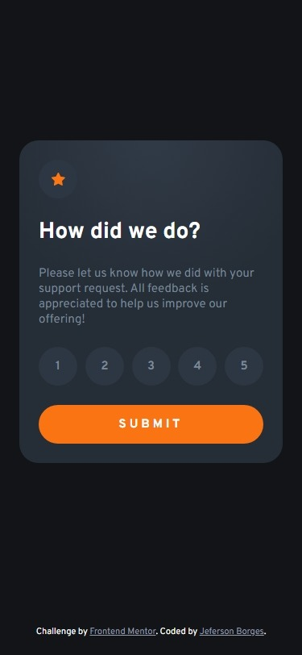
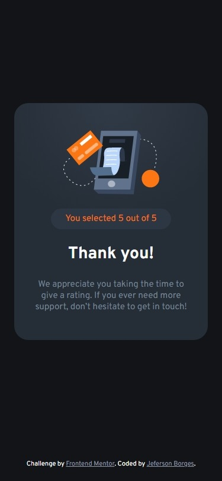
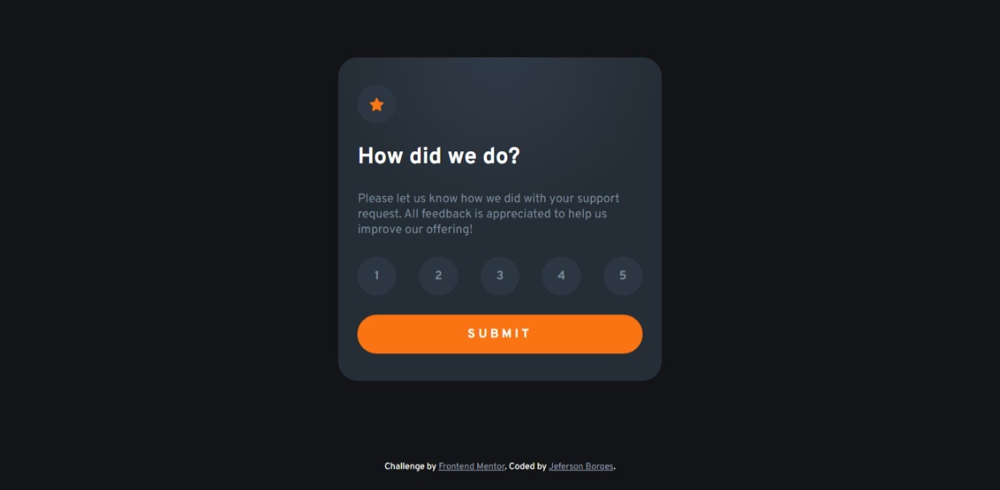
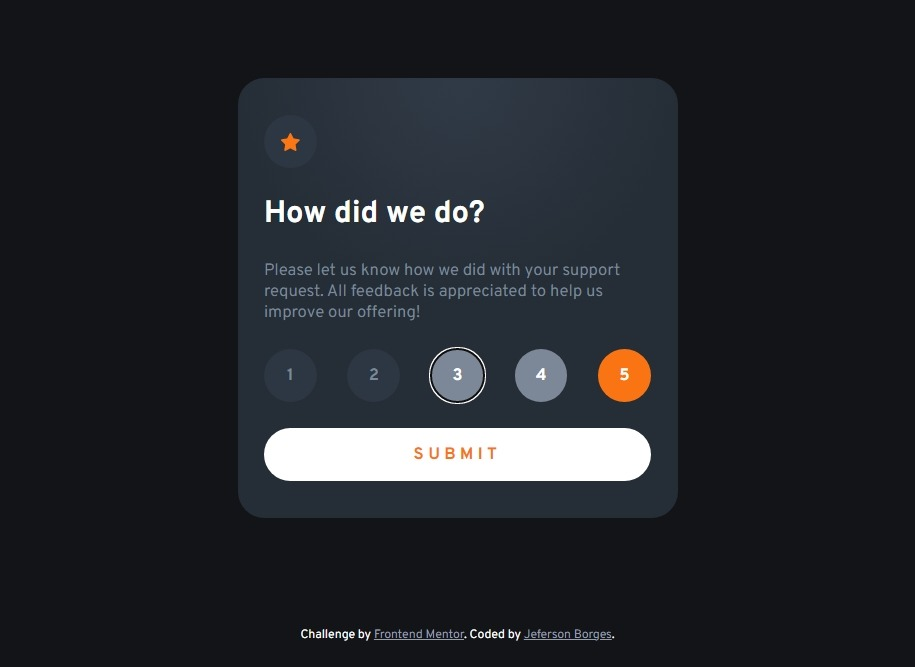
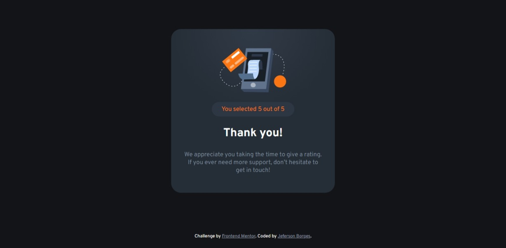

# Frontend Mentor - Interactive rating component solution

This is a solution to the [Interactive rating component challenge on Frontend Mentor](https://www.frontendmentor.io/challenges/interactive-rating-component-koxpeBUmI).

A simple challenge can always help to learn more. This time, the challenge was to improve accessibility without sacrificing the design.

Any comments on the code are welcome!

## Table of contents

- [Overview](#overview)
  - [The challenge](#the-challenge)
  - [Screenshot](#screenshot)
    - [Mobile](#mobile)
    - [Desktop](#desktop)
  - [Links](#links)
- [My process](#my-process)
  - [Built with](#built-with)
  - [What I learned](#what-i-learned)
  - [Continued development](#continued-development)
  - [Useful resources](#useful-resources)
- [Author](#author)

## Overview

### The challenge

Users should be able to:

- View the optimal layout for the app depending on their device's screen size
- See hover states for all interactive elements on the page
- Select and submit a number rating
- See the "Thank you" card state after submitting a rating

### Screenshot

#### Mobile




#### Desktop





### Links

- Solution URL: [Github repository](https://github.com/jefersonBorges/fem-interactive_rating_component)
- Live Site URL: [Github live page](https://jefersonborges.github.io/fem-interactive_rating_component/)

## My process

### Built with

- Semantic HTML5 markup
- CSS Flexbox and Grid
- SASS
- JavaScript DOM

### What I learned

Since the rating is info to be sent, I used a form with input type="radio". The solution to hide the box of the input but still be able to display the events of hover, focus and checked on it:

```scss
input[type="radio"] {
  
  position: absolute;

  width: 0;
  height: 0;
  
  &:hover + label {
    color: $white;
    background-color: $medium-grey;
  }

  &:focus-visible + label {
    outline: -webkit-focus-ring-color auto 1px;
    color: $white;
    background-color: $medium-grey; 
  }

  &:checked + label {
  color: $white;
    background-color: $orange;
  }
}
```

The form is sent when the user clicks on the submit button or when the user hits key 'enter'. The solution I used here so there is no need to apply two events is as follows. This solution also binds the 'this' reference to the event, allowing the code to be cleaner.

```js
bind_events: function(){
  this.$form_rating.onsubmit = this.submit_rating.bind(this)
}
```

### Continued development

- Page responsivity
- Page accessibility
- CSS best practices
- Programming logic

### Useful resources

- [26 Rules I Follow When Writing CSS To Make It Concise and Readable](https://arbaouimehdi.medium.com/26-rules-i-follow-when-writing-css-to-make-it-concise-and-readable-b56547a345b4) - This article is helping me better organize my CSS coding.

- [Interactive controls are keyboard focusable](https://developer.chrome.com/docs/lighthouse/accessibility/focusable-controls/) - This article helping me better understand the focus indicator in the interactive elements on the page.

## Author

- GitHub - [jefersonBorges](https://github.com/jefersonBorges/jefersonBorges)
- Frontend Mentor - [@jefersonBorges](https://www.frontendmentor.io/profile/jefersonBorges)
- Linkedin - [Jeferson Borges Linkedin](https://www.linkedin.com/in/jeferson-borges-543b34229)
